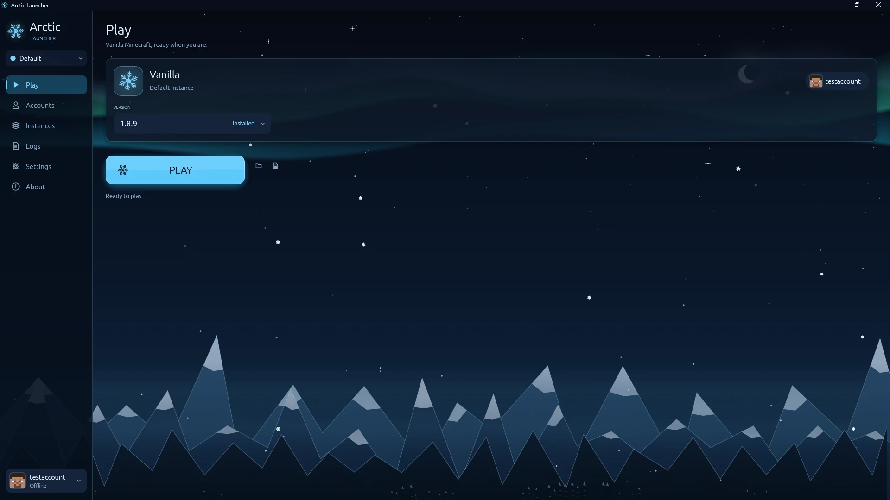

<p align="center">
  
</p>

<h1 align="center">Arctic Launcher</h1>

<p align="center">
  A fast, lightweight Minecraft launcher.<br>
  Every release, the right Java, your accounts, a few clicks.
</p>

<p align="center">
  <a href="https://github.com/brksfrb/arctic-launcher/releases/latest"></a>
  <a href="https://github.com/brksfrb/arctic-launcher/actions/workflows/ci.yml"></a>
  <a href="LICENSE"></a>
  
</p>

<p align="center">
  <a href="https://github.com/brksfrb/arctic-launcher/releases/latest"><b>Download</b></a> ·
  <a href="https://arcticlauncher.com">Website</a> ·
  <a href="docs/cli.md">Command line</a>
</p>

<p align="center">
  
</p>

## Why Arctic

- **Plays every Minecraft release.** Pick a version and press Play. Arctic downloads the
  game and the exact Java it needs, so you don't install Java yourself.
- **Fast.** Downloads run in parallel over dozens of connections: a complete fresh install
  takes about 20 seconds on a fast connection, and relaunching an installed version is
  instant.
- **Light.** One small native app, no Electron and no browser engine. It uses almost no
  CPU while you play.
- **Your accounts, side by side.** Sign in with Microsoft (browser or a short code) or
  play offline. Keep several accounts and switch in one click.
- **Profiles.** Keep completely separate setups on one PC, each with its own accounts,
  settings, instances and worlds. Switch from the top of the sidebar.
- **Live logs.** Minecraft's output appears inside the launcher, readable, searchable and
  filterable by warnings or errors.
- **Made to look at.** An animated arctic night with aurora, snowfall and shooting stars.
  Aurora, Dark and Light themes.
- **Command line included.** `arctic launch 1.21.4 --offline Steve`, scriptable JSON
  output, and desktop shortcuts that start a version directly.
- **Stays up to date.** Updates install themselves in seconds, verified before they're
  applied.
- **Open source** under the GPL-3.0.

## Install

### Windows

1. Download **`arctic-launcher-windows-x64.exe`** from the
   [latest release](https://github.com/brksfrb/arctic-launcher/releases/latest).
2. Run it. There is no installer; put it wherever you like.

Windows may show a SmartScreen prompt for new apps. Choose **More info → Run anyway**.

### Linux

1. Download **`arctic-launcher-linux-x64`** from the
   [latest release](https://github.com/brksfrb/arctic-launcher/releases/latest).
2. Make it executable and run it:

   ```sh
   chmod +x arctic-launcher-linux-x64
   ./arctic-launcher-linux-x64
   ```

Works on X11 and Wayland desktops with OpenGL.

### Command line tool (optional)

Grab `arctic-windows-x64.exe` or `arctic-linux-x64` from the same release and put it on
your `PATH` as `arctic`. See the [command line guide](docs/cli.md).

## Getting started

1. Open **Accounts** and add your Microsoft account, or an offline name.
2. On **Play**, pick a version. The picker shows which ones are already installed.
3. Press **Play**.

Memory, window size, theme and more are under **Settings**. To keep a separate setup,
for example for testing or family members, create a **profile** from the switcher under
the logo.

## Command line

```sh
arctic launch                          # latest release, active account
arctic launch 1.20.1 --account Alex --memory 6G
arctic launch latest --offline Steve --wait
arctic install 1.21.4                  # download only
arctic profiles create "Speedruns" --switch
arctic open --launch 1.21.4            # open the launcher and start playing
```

Everything also works with `--json` for scripts. Full reference:
[docs/cli.md](docs/cli.md).

## FAQ

**Where are my files?**
Windows: `%LOCALAPPDATA%\ArcticLauncher`. Linux: `~/.local/share/ArcticLauncher`.
Each profile lives in `profiles/<name>/`. Worlds are inside
`instances/vanilla/minecraft/saves`. `arctic paths` prints them all.

**Where are my sign-in details stored?**
Only on your computer, in your profile folder. Arctic talks to Microsoft, Xbox and Mojang
to sign you in and nowhere else.

**Does it need Java?**
No. Arctic downloads the official Java runtime each Minecraft version needs and keeps it
up to date.

**Mods?**
Fabric, Quilt and Forge instances are on the way.

**Is this an official Minecraft product?**
No. Arctic Launcher is an independent project, not approved by or associated with Mojang
or Microsoft.

## Building from source

See [docs/building.md](docs/building.md). The architecture overview is in
[docs/architecture.md](docs/architecture.md).

## License

[GPL-3.0-or-later](LICENSE). "Minecraft" is a trademark of Mojang Synergies AB.
