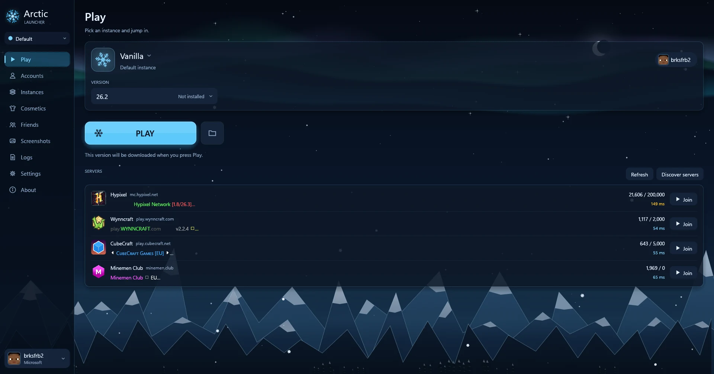
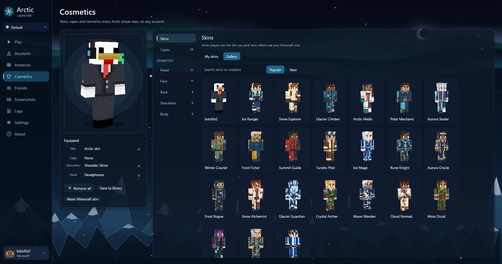

<p align="center">
  
</p>

<h1 align="center">Arctic Launcher</h1>

<p align="center">
  A fast, lightweight Minecraft launcher.<br>
  Every release, mod loaders, mods, skins and playing with friends, in one small app.
</p>

<p align="center">
  <a href="https://github.com/brksfrb/arctic-launcher/releases/latest"></a>
  <a href="https://github.com/brksfrb/arctic-launcher/actions/workflows/ci.yml"></a>
  <a href="LICENSE"></a>
  
</p>

<p align="center">
  <a href="https://github.com/brksfrb/arctic-launcher/releases/latest"><b>Download</b></a> ·
  <a href="https://arcticlauncher.com">Website</a> ·
  <a href="docs/cli.md">Command line</a> ·
  <a href="mailto:support@arcticlauncher.com">Support</a>
</p>

<p align="center">
  <a href="https://flashhosting.net">Supported by&nbsp;<picture><source media="(prefers-color-scheme: dark)" srcset="docs/assets/flash-hosting-light.svg"></picture>&nbsp;<b>Flash Hosting</b></a>
</p>

<p align="center">
  
</p>

## Why Arctic

- **Plays every Minecraft release.** Pick a version and press Play. Arctic downloads the
  game and the exact Java it needs, so you don't install Java yourself.
- **Fast.** Downloads run in parallel over dozens of connections: a complete fresh install
  takes about 20 seconds on a fast connection, and relaunching an installed version is
  instant.
- **Light.** One small native app, no Electron and no browser engine. It uses almost no
  CPU while you play.
- **Mods in a click.** Create Fabric, Quilt, NeoForge or Forge instances, then search
  Modrinth and install mods with their dependencies, or install a whole modpack in one
  click. Each instance keeps its own version, mods, worlds and Java settings.
- **Bring your stuff over.** Arctic finds what you have in the Minecraft Launcher, Prism,
  MultiMC, the Modrinth App, CurseForge, ATLauncher, GDLauncher, TLauncher, Lunar, Badlion,
  Feather and LabyMod and copies your instances, worlds, servers and settings (the
  originals stay as they are). Import single worlds from a folder or a .zip, and back them
  up with one click.
- **Play together.** Invite friends into your world with a code. No server, no port
  forwarding: open your world to LAN and Arctic connects you directly (or through an
  encrypted relay when a direct link isn't possible).
- **Wear any skin, any cape, free.** Pick a skin from your library (or copy a player's by
  name), choose a cape or use your own image (animated ones too), and every Arctic player
  sees it, on any account. Preview everything on a 3D model. Microsoft accounts can also change their real
  Minecraft skin from here.
- **Cosmetics and emotes, free.** Hats, headphones, back items, shoulder pets and more, plus
  emotes from a wheel in game. Every Arctic player sees them.
- **Skin gallery.** Browse skins other players shared, search by name or creator, and wear
  one in a click. Share your own from your library.
- **Arctic Client.** Vanilla gets a fresh look: restyled menus (pick Arctic, Aurora or
  Classic), over thirty HUD widgets (FPS, CPS, ping, TPS, keystrokes, coordinates, speed,
  armor, effects, target health, reach, combo, a compass, a minimap, a stopwatch, item
  counts and more) that line up on their own and snap into place when you move them,
  Zoom, Freelook, Fullbright, Toggle Sprint and Sneak, a crosshair editor (your own picture
  too, colored by what you aim at), a smooth font, chat timestamps and mentions, quick
  chat keys with {x} {y} {z}, waypoints, your own time of day, block outline and hit
  color, scoreboard tweaks, a streamer mode, and everyone's Arctic looks in game. Press Right Shift in game for the Arctic menu. It's on
  by default for Vanilla from 1.8.9 up to the newest release (1.8.9, 1.9.4, 1.10.2,
  1.11.2, 1.12.2 and 1.15.2 onward), comes to Fabric and Quilt instances too, and you can turn
  it off per instance, or choose pure vanilla during setup.
- **Replays.** The Arctic Client keeps the last minutes of your game; save them when
  something happens, then watch from any angle in 3D, seek around, or export a video.
- **Friends, chat and voice.** Add friends with a code, see who's online and where, invite
  them to your server, chat and send screenshots from the launcher or in game, and talk
  with proximity voice chat (it also works with Simple Voice Chat servers).
- **Duels in two clicks.** Start a duel from the in-game Friends tab: Arctic makes a flat
  arena with a kit and shares it through Play together; your friend joins from the invite.
- **Resource packs without a restart.** Search Modrinth from the in-game menu and a pack
  is on a second later.
- **Performance, built in.** One switch adds Sodium, Lithium, FerriteCore, ImmediatelyFast,
  EntityCulling and ModernFix to Vanilla for much higher FPS, fetched from Modrinth for your version.
  It's on by default and works on any version Fabric supports.
- **Your accounts, side by side.** Sign in with Microsoft in the browser or with a short
  code. Keep several accounts and switch in one click. Sign-ins stay on your PC, encrypted
  for your user account, and never leave it except to Microsoft and Mojang.
- **Profiles.** Keep completely separate setups on one PC, each with its own accounts,
  settings, instances and worlds. Switch from the top of the sidebar.
- **Screenshots in one place.** Every instance's screenshots, newest first: open, copy,
  or send one to a friend.
- **Crash reports, only if you say so.** When the game crashes, Arctic explains it in plain
  language and can send the log so it gets fixed (ask each time, always or never in Settings).
  Your name, folders, sign-in details, e-mails and IP addresses are removed first.
- **Live logs.** Minecraft's output appears inside the launcher, readable, searchable and
  filterable by warnings or errors.
- **Proxy.** Send the launcher and the game through a SOCKS5 proxy. Server connections go through it with the Arctic Client (Vanilla and Fabric instances); other games only proxy Minecraft's login.
- **Made to look at.** An animated arctic night with aurora, snowfall and shooting stars.
  Aurora, Dark and Light themes.
- **Discord status.** Friends see what you're playing. Turn it off in Settings.
- **Command line included.** Launch versions and instances, install mods and manage
  profiles from a terminal, with scriptable JSON output.
- **Stays up to date.** Updates install themselves in seconds, verified before they're
  applied.
- **Open source** under the GPL-3.0.

## Install

### Windows

1. Download **`arctic-launcher-windows-x64.exe`** from the
   [latest release](https://github.com/brksfrb/arctic-launcher/releases/latest).
2. Run it. There is no installer; put it wherever you like.

Windows may show a SmartScreen prompt for new apps. Choose **More info → Run anyway**.

### macOS

1. Download **`arctic-launcher-macos.zip`** from the
   [latest release](https://github.com/brksfrb/arctic-launcher/releases/latest) and unzip it.
2. Move **Arctic Launcher** to Applications and open it. It runs on Apple Silicon and Intel
   Macs.

The app isn't notarized by Apple yet, so the first time macOS asks: right-click the app,
choose **Open**, then **Open** again.

### Linux

1. Download **`arctic-launcher-linux-x64`** from the
   [latest release](https://github.com/brksfrb/arctic-launcher/releases/latest).
2. Make it executable and run it:

   ```sh
   chmod +x arctic-launcher-linux-x64
   ./arctic-launcher-linux-x64
   ```

Works on X11 and Wayland desktops with OpenGL.

### Command line tool (optional)

Grab `arctic-windows-x64.exe`, `arctic-macos` or `arctic-linux-x64` from the same release and put it on
your `PATH` as `arctic`. See the [command line guide](docs/cli.md).

## Getting started

The first time you open Arctic, a short setup picks your theme, account, memory and
first instance. After that:

1. On **Play**, pick a version or an instance. The picker shows which versions are
   already installed.
2. Press **Play**.

For mods, open **Instances**, create a Fabric instance and use **Browse mods**. To play
with friends, open **Play together**. Memory, window size, theme and more are under
**Settings**. To keep a separate setup,
for example for testing or family members, create a **profile** from the switcher under
the logo.

## Command line

```sh
arctic launch                          # latest release, active account
arctic launch 1.20.1 --account Alex --memory 6G
arctic launch latest --wait
arctic install 1.21.4                  # download only
arctic instances create "Fabric" --version 26.3 --loader fabric
arctic mods install sodium --instance fabric
arctic launch --instance fabric
arctic profiles create "Speedruns" --switch
arctic open --launch 1.21.4            # open the launcher and start playing
```

Everything also works with `--json` for scripts. Full reference:
[docs/cli.md](docs/cli.md).

## FAQ

**Where are my files?**
Windows: `%LOCALAPPDATA%\ArcticLauncher`. macOS: `~/Library/Application Support/ArcticLauncher`.
Linux: `~/.local/share/ArcticLauncher`.
Each profile lives in `profiles/<name>/`. Worlds are inside
`instances/vanilla/minecraft/saves`. `arctic paths` prints them all.

**Where are my sign-in details stored?**
Only on your computer, in your profile folder, encrypted so that only your user account on
that PC can read them (a copied file is useless elsewhere). They are sent only to Microsoft, Xbox and
Mojang to sign you in. Arctic's own service for looks never receives your password or
tokens: it checks who you are the same way a Minecraft server does.

**What does Arctic connect to?**
Mojang and Microsoft for the game and sign-in, Modrinth and the Fabric, Quilt, NeoForge
and Forge servers for mods and loaders, GitHub for updates, and the Arctic looks service,
which shares the skin and cape you picked with other Arctic players. Play together connects you directly to your friend, using a public
relay only to set that up or when a direct link fails.

**Does it need Java?**
No. Arctic downloads the official Java runtime each Minecraft version needs and keeps it
up to date.

**Mods?**
Yes. Create a Fabric, Quilt, NeoForge or Forge instance under **Instances** and browse
Modrinth from there. You can also drop `.jar` files into the instance's `mods` folder.

**Do my friends need Arctic to play together?**
Yes, both of you need Arctic Launcher, the same Minecraft version and the same mods.

**Is this an official Minecraft product?**
No. Arctic Launcher is an independent project, not approved by or associated with Mojang
or Microsoft.

<p align="center">
  
</p>

## Building from source

See [docs/building.md](docs/building.md). The architecture overview is in
[docs/architecture.md](docs/architecture.md).

Polarium, our mod for huge crowds of players (entities drawn on the GPU, their
work spread across CPU cores), lives in its own repository:
[brksfrb/polarium](https://github.com/brksfrb/polarium).

## Supported by

<a href="https://flashhosting.net"><picture><source media="(prefers-color-scheme: dark)" srcset="docs/assets/flash-hosting-light.svg"></picture></a>

Arctic is supported by **[Flash Hosting](https://flashhosting.net)**: Minecraft servers that stay up
24/7, priced by player slots, not gigabytes. Play together runs while you're online; Flash Hosting
keeps your world up when you're not.

<br clear="left">

## License

[GPL-3.0-or-later](LICENSE). "Minecraft" is a trademark of Mojang Synergies AB.
